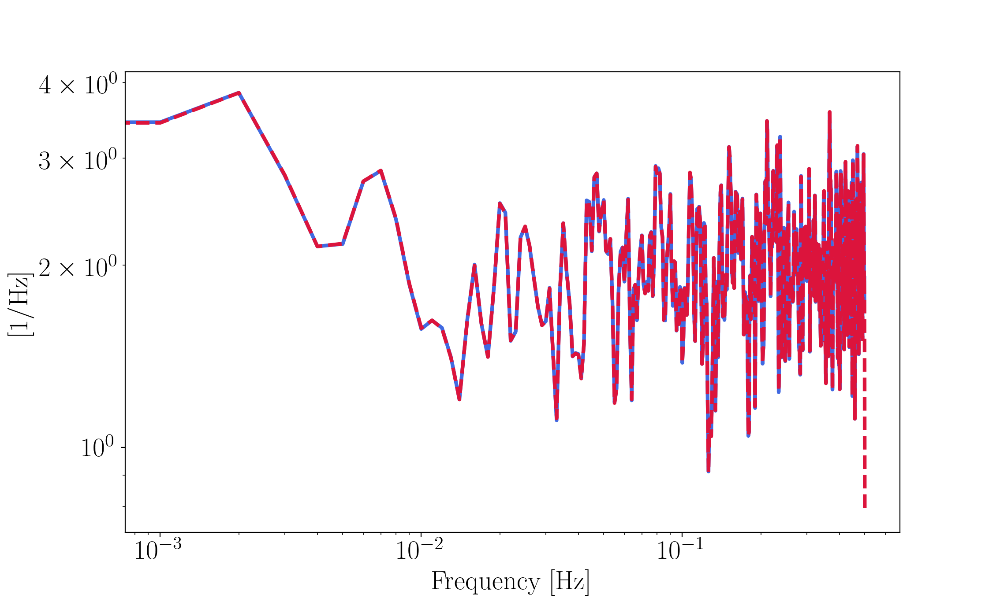

# spectral

A basic toolbox for performing spectral analyses. It is a translation of parts of the LTPDA Matlab toolbox that was used for the analysis of the ESA LISA Pathfinder mission.

* More details about LISA Pathfinder: https://sci.esa.int/web/lisa-pathfinder
* Source to the LTPDA toolbox: https://www.elisascience.org/ltpda/

The installation is as usual 
```python
python3 setup.py install
```

An example for a given time series `data` stored in a numpy array:

```python
fs = 1.0 # The sampling frequency of the time series is required

f, S, Se, ENBW, N = lpsd(data, fs, Jdes=200, win='nuttall4b', olap=10,order=0,DOPLOT=True,VERBOSE=False)
```


Contents, functions:

- `genTimeSeriesFromPSD(S,fs)`: Generate time series from a given PSD model.
- `window(winType, N, alpha=0.01)`: A window function. Contains numerous types of windows. See [this](https://pure.mpg.de/rest/items/item_152164_1/component/file_152163/content "A comprehensive list of window functions and some new at-top windows") paper by G. Heinzel
- `psd(x, fs, y=None)`: A PSD function adapted from LTPDA.
- `welchpsd(data, fs, nperseg)`: Wrapper around the scipy.signal Welch PSD function.
- `ComputeTD(FS, dt)`: iFFT back to time domain.
- `binData(y, x)`: A simple function to bin frequency series data.
- `WelfordMean(y)`: The Welford method of computing/updating the mean.
- `lpsd(d, fs)`: Power spectrum estimation on logarithmically spaced frequency grid. See [this](https://core.ac.uk/download/pdf/210665861.pdf) paper for details.
- `lpflogpsd(data, fs)`: Modification of the above used for the analysis of the [LPF](https://link.aps.org/doi/10.1103/PhysRevLett.120.061101) data.

NK 2021

## Another example comparing the PSD methods

```python
import numpy as np
from spectral import psd, welchpsd

data = np.random.normal(0,1, 10000) # just some data
fs = 1. # a given sampling frequency of the data 
npoints = 1000

f1, S1, _= psd(data, fs, nperseg=npoints, win='bh92', olap=0.5) # use the custom-made function
f2, S2   = welchpsd(data, fs, npoints, olap=0.5) # use a wrapper of the scipy equivalent

plt.loglog(f1,S1, lw=3,color='royalblue')
plt.loglog(f2,S2, lw='3',linestyle='--',color='crimson')
plt.ylabel(r'[$1/\mathrm{Hz}$]')
plt.xlabel(r'Frequency [$\mathrm{Hz}$]')
plt.show()
```

